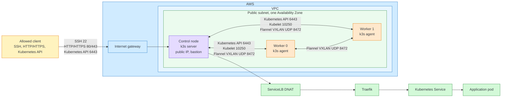

# Terraform k3s on AWS

A small k3s cluster provisioned with Terraform for learning AWS networking, security groups, and Kubernetes bootstrap behavior.

The cluster uses one public subnet in one Availability Zone, one control-plane node, and two worker nodes. Terraform creates the VPC wiring, security groups, EC2 instances, and first-boot k3s installation. `hello-ingress.yaml` is the end-to-end smoke test.

## Architecture


## What this demonstrates

- Terraform root-module composition and reusable VPC / security-group modules.
- Security-group rules using reusable named ingress presets plus custom rules.
- EC2 bootstrap using cloud-init `user_data` and a shared k3s token.
- Worker placement with `count.index % length(public_subnet_ids)`.

## Requirements

- Terraform
- AWS CLI credentials with EC2/VPC permissions
- An existing SSH public key
- `kubectl` for cluster validation
- AWS region with an Ubuntu ARM64 AMI and an ARM-compatible instance type, such as `t4g.micro`

## Configuration

Create an untracked `terraform.tfvars` from your local values. Use the example file as reference:

```hcl
aws_region    = "ap-southeast-3"
ec2_type      = "t4g.micro"
key_pair_name = "terra-k8s-key"
k3s_token     = "replace-with-a-long-random-token"
```

Use a configurable SSH key path rather than a machine-specific absolute path:

```hcl
public_key = file(pathexpand(var.public_key_path))
```

`terraform.tfvars` provides static values for variables declared in the root module. Resource references, module output wiring, data sources, and computed expressions stay in `.tf` files.

## Deploy

```bash
terraform init
terraform fmt -recursive
terraform validate
terraform plan
terraform apply
```

Get the control-node address:

```bash
terraform output -raw bastion_ip
terraform output -raw bastion_dns
```

SSH through the control node when worker security groups permit SSH only from the control-node security group:

```bash
export CONTROL_IP=$(terraform output -raw bastion_ip)
ssh -i <PRIVATE_KEY_PATH> ubuntu@$CONTROL_IP
```

## Validate

Confirm that all nodes joined:

```bash
kubectl get nodes -o wide
kubectl get pods -A -o wide
```

Apply the included workload:

```bash
kubectl apply -f hello-ingress.yaml
kubectl get ingress,svc,pods -o wide
```

Send the request to the control node's real public IP. If `hello-ingress.yaml` declares a host, include its `Host` header:

```bash
curl -i http://"$EC2_IP"
# curl -i -H 'Host: <host-from-hello-ingress.yaml>' http://"$EC2_IP"
```

Do not use `curl localhost` to test ServiceLB. k3s ServiceLB installs DNAT rules. Loopback traffic does not take the same PREROUTING path as traffic addressed to the node IP, and `ss -tlnp` will not show a userspace listener on port 80.

## Security-group design

The security-group module contains named ingress presets, such as `ssh`, `k8s_api`, `kubelet`, and `flannel_vxlan`. The caller supplies the source CIDR or source security-group ID.

The control and worker security groups cannot both embed their reverse references inside module arguments. That creates a Terraform graph cycle. This repo keeps worker rules that refer to the control SG in the worker module call, then creates the control-side rules from the worker SG as root-level `aws_security_group_rule` resources.

Flannel VXLAN uses UDP/8472 beneath Kubernetes traffic. Security groups must permit that overlay traffic in both directions between nodes. TCP connection tracking for the application request does not cover a separate UDP VXLAN flow.

## Bootstrap behavior

`user_data` runs on first boot. Editing the script after an EC2 instance already exists does not rerun it. Replace the instance when testing an amended bootstrap script:

```bash
terraform apply -replace='aws_instance.ec2_control'
terraform apply -replace='aws_instance.ec2_workers[0]'
```

A shared `k3s_token` allows workers to join the control plane. It is suitable for this short-lived lab, but it appears in Terraform state and instance user data. Production infrastructure should source it from SSM Parameter Store or Secrets Manager.

## Teardown

This project creates billable EC2 and EBS resources. Destroy it after each lab session:

```bash
terraform destroy
```

Then verify the AWS console has no remaining instances, volumes, elastic IPs, or security groups created by this project.

## Limits

This is a learning environment, not a production Kubernetes design.

- One AZ and one control-plane node. No control-plane HA.
- Public subnet placement to avoid NAT Gateway cost.
- One shared, plaintext lab token in Terraform state and `user_data`.
- No remote state locking, autoscaling, backups, monitoring, or automated node replacement.
- k3s bundled components rather than a managed Kubernetes service.

A production follow-up would use multiple AZs, private worker subnets, a load balancer, encrypted secret delivery, remote state with locking, monitoring, and either an HA k3s topology or EKS.

## Notes

Inspired by the project structure discussion in [`corymhall/example-terraform-project`](https://github.com/corymhall/example-terraform-project). The implementation here is intentionally smaller and focused on one k3s lab cluster.
